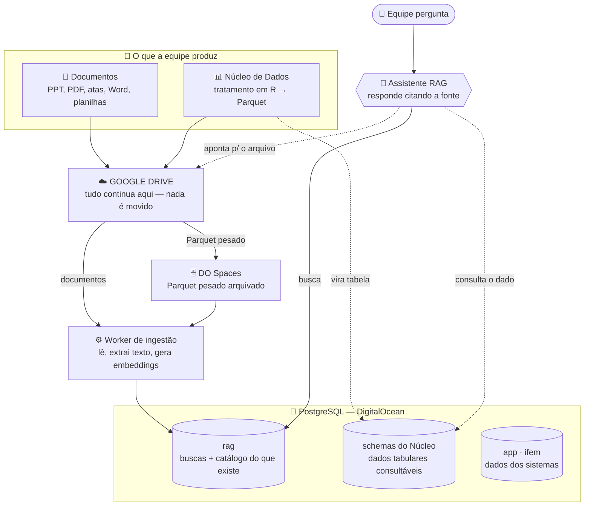

# Base de Conhecimento FNP — Visão geral, arquitetura e próximos passos

> **Para quem é:** toda a equipe da FNP. Este é o documento para **apresentar o projeto**, entender o desenho
> e saber **o que cada um precisa fazer agora**. Linguagem acessível — não precisa ser da área técnica.

---

## O que estamos construindo

Um **assistente de busca inteligente** para a FNP: você faz uma pergunta em linguagem natural
("quais os critérios do Programa X?", "qual o PIB de Recife em 2024?") e ele responde **citando exatamente
de onde tirou a informação** — um documento no Drive ou um dado da nossa base. Em vez de caçar arquivo,
você pergunta e recebe a resposta com a fonte.

---

## O desenho da arquitetura

> **Leia o diagrama assim:** as coisas **entram** pelo topo (Drive e dados do R), são **organizadas** no meio
> (banco no DigitalOcean) e **saem** como respostas embaixo (o assistente).



<details>
<summary>Versão simplificada (caso o diagrama acima não apareça)</summary>

```
  DOCUMENTOS (PPT/PDF/atas)        DADOS TABULARES (R → Parquet)
           │                                  │
           └────────────► GOOGLE DRIVE ◄───────┘     (nada sai daqui)
                              │
               ┌──────────────┼───────────────┐
               ▼              ▼
         [Worker lê]   [Parquet → DO Spaces]
               │              │
               ▼              ▼
         ┌──────────────────────────────────────┐
         │     PostgreSQL (DigitalOcean)         │
         │   • rag          → buscas + catálogo  │
         │   • Núcleo (schemas) → tabelas consultáveis│
         │   • app / ifem   → sistemas           │
         └──────────────────────────────────────┘
                          ▲
                          │ busca
              🤖 Assistente RAG  ◄──── 🙋 Equipe pergunta
                          │
                          └─► responde citando a fonte
                              (arquivo no Drive OU dado no banco)
```
</details>

---

## As três camadas, em uma frase cada

| Camada | O que é | Exemplo de pergunta que ela responde |
|---|---|---|
| **Documentos no Drive** | Tudo que já está no Drive (apresentações, atas, regulamentos) | *"O que foi decidido na 89ª Reunião Geral?"* |
| **Dados do Núcleo** (schemas no banco) | Bases tabulares tratadas no R (PIB, indicadores, séries) | *"Qual o PIB dos 10 maiores municípios filiados?"* |
| **Sistemas** (`app`, `ifem`...) | Dados que vivem dentro de cada sistema da FNP | *"O município X está adimplente?"* |

O **assistente (RAG)** é o que costura as três: ele sabe **onde** cada coisa está e responde citando a fonte.

> 🧭 **Como o assistente "sabe onde procurar":** ao receber a pergunta, ele primeiro decide o tipo.
> Se é sobre um **documento** ("o que foi decidido na ata X?"), ele busca no acervo indexado do Drive.
> Se é sobre um **dado** ("PIB dos 10 maiores municípios"), ele consulta direto a tabela no banco —
> porque ranking, soma e filtro são conta, não "achar um texto parecido". Por isso as duas coisas
> ficam em lugares diferentes: documento no índice de busca, dado em tabela.

---

## A regra de ouro (e o que NÃO muda)

> 🟢 **Nada sai do Google Drive.** Apresentações, PowerPoint, PDFs e atas continuam exatamente onde estão.
> O sistema só **lê** para indexar — nunca move, nunca apaga, nunca copia pra "dentro do banco".

A diferença entre os dois tipos de material:

- 📄 **Documento** você quer **encontrar** → fica no Drive, o assistente acha e aponta.
- 📊 **Dado tabular** (PIB, indicadores) você quer **consultar/cruzar** → vira tabela num schema do Núcleo, no mesmo banco.

Por isso: **apresentação e PowerPoint nunca viram tabela no banco.** Só os dados tabulares do Núcleo.

---

## O que cada um precisa fazer agora

### 👥 Toda a equipe (documentos no Drive)
**Não muda nada no seu dia a dia.** Você continua salvando no Drive. Só siga duas convenções simples:
1. Salvar nas pastas certas → [`ESTRUTURA_DRIVE.md`](ESTRUTURA_DRIVE.md)
2. Nomear os arquivos no padrão (data + assunto, sem espaço/acento) → [`GUIA_ARQUIVOS.md`](GUIA_ARQUIVOS.md)

Quer entender melhor *por que* isso importa? → [`COMO_FUNCIONA_A_BASE_DE_CONHECIMENTO.md`](COMO_FUNCIONA_A_BASE_DE_CONHECIMENTO.md)

### 📊 Núcleo de Dados (bases tabulares)
Para **cada base que você domina** (PIB, indicadores, etc.):
1. Exporte em **Parquet** pelo R (ou Excel, se a origem for manual).
2. Preencha a **ficha (dicionário)** explicando o que tem dentro → [`COMO_DOCUMENTAR_SEUS_DADOS.md`](COMO_DOCUMENTAR_SEUS_DADOS.md)
3. Entregue **o arquivo + a ficha** na pasta `Planilhas e Dados/` do Drive. O Pedro cuida do resto (subir no banco).

### 🛠️ TIC (Pedro)
Montar o banco, conectar Drive e Spaces, rodar o worker de ingestão e carregar os datasets.
Detalhes técnicos em [`TIC/playbook-ingestao-dados.md`](../../TIC/playbook-ingestao-dados.md) e [`docs/tecnico/ARQUITETURA.md`](../tecnico/ARQUITETURA.md).

---

## As fases até o RAG 100% funcional

> 📌 **Fonte única de status:** esta é a **visão simplificada para a equipe**. O status canônico
> (fase a fase, com critério de conclusão) vive em [`docs/tecnico/FASES.md`](../tecnico/FASES.md) —
> é de lá que esta tabela é derivada. Se as duas divergirem, vale o `FASES.md`.

> Legenda: ✅ concluído · 🔄 em andamento · ⏳ a fazer. *(O Pedro atualiza o status conforme avança.)*

| Fase | O que acontece | Quem | Status |
|---|---|---|---|
| **0. Padrões definidos** | Playbooks, modelos e este guia prontos (a "regra do jogo") | TIC | ✅ |
| **1. Banco e infra** | Criar schemas, roles e tabelas no PostgreSQL; configurar o Spaces | TIC | 🔄 |
| **2. Conectar o Drive** | Worker passa a ler o Drive, extrair texto e gerar o índice de busca | TIC | ⏳ |
| **3. Organizar o acervo** | Equipe arruma/nomeia arquivos no Drive; Núcleo entrega 1ªs bases documentadas | **Equipe + Núcleo** | ⏳ |
| **4. Busca + respostas** | Ligar a busca semântica ao Claude e testar com perguntas reais | TIC | ⏳ |
| **5. Interface** | Tela simples onde qualquer um digita a pergunta e recebe a resposta | TIC | ⏳ |
| **6. RAG 100%** | Todo o acervo indexado, dados do Núcleo no banco, equipe usando no dia a dia | Todos | ⏳ |

> **Onde a equipe entra de verdade:** a **Fase 3**. Quanto melhor organizado o Drive e mais bases documentadas,
> mais rápido e mais preciso o assistente fica. O trabalho de vocês agora é o que determina a qualidade do resultado.

---

## Dúvidas

**Pedro Ivo** — pedro.machado@fnp.org.br
